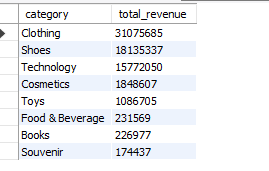

# EXPLORATORY-ANALYSIS-OF-ISTANBUL-SHOPpING-MALL-CUSTOMER-DATA-(SQL)
## Introduction
The main of this project is explore our customer shopping dataset to answer some busniess question and generate visualazation and insights from our dataset

## Objective
The query our data and answer Business questions to gain insights on Istanbul's product and Customers

## Product Insights

1. **TOP PRODUCTS BY REVENUE GENERATED**
    ```sql
   SELECT category, round(SUM(price),0) total_revenue
	  FROM orders o
		JOIN payments p ON p.pay_id = o.pay_id
		GROUP BY category 
		ORDER BY SUM(price) DESC;
    ```
    

2. **TOP PRODUCTS BY QUANTITY SOLD**
    ```sql
    SELECT category, SUM(quantity) total_quantity
	    FROM orders o
		  GROUP BY category 
		  ORDER BY SUM(quantity) DESC
    ```
    

3. **WHAT PRODUCTS ARE WHICH GENDERS PURCHASING THE MOST?**
    ```sql
   SELECT category, gender,SUM(quantity)
	FROM orders o
		JOIN customers c ON c.customer_id = o.cust_id
        GROUP BY category, gender
        ORDER BY 1,2;
    ```
    

4. **WHAT PRODUCTS ARE WHICH AGE GROUP PURCHAING THE MOST?**
    ```sql
   SELECT category,
	CASE WHEN age < 30 THEN 'Young Adult'
		 WHEN age < 50 THEN 'Middle Aged'
		 ELSE 'Seniors'
	END AS age_category , SUM(quantity) total_quantity
		FROM customers c
        JOIN orders o ON o.cust_id = c.customer_id
        GROUP BY 1,2
        ORDER BY 1,2 ;
    ```
    

## Customer Insights

5. **WHICH AGE GROUP GENERATES THEY MOST REVENUE?**
    ```sql
   SELECT
	CASE WHEN age < 30 THEN 'Young Adult'
		 WHEN age < 50 THEN 'Middle Aged'
		 ELSE 'Seniors'
	END AS age_category , ROUND(SUM(price),0) revenue
		FROM customers c
        JOIN orders o ON o.cust_id = c.customer_id
        JOIN payments p ON p.pay_id = o.pay_id
        GROUP BY age_category
        ORDER BY revenue ;
    ```
    

6. **WHICH PAYMENT METHOD ARE CUSTOMERS USING THE MOST?**
    ```sql
    SELECT pay_method, COUNT(pay_method) frequency
	FROM payments
    GROUP BY pay_method
    ORDER BY 2 DESC;
    ```
    

7. **MOST POPUAR SHOPPING MALL**
    ```sql
    SELECT shopping_mall, COUNT(shopping_mall) frequency
	FROM orders
    GROUP BY shopping_mall
    ORDER BY 2 DESC;

    ```
    


## Conclusion

This documentation provides a comprehensive overview of the SQL project for Istanbul's Shopping Mall, including the datasets, case study questions, SQL queries, and corresponding results. 


## Note
For more indept exploration of our dataset and generation of insights using python click the  <a href="https://nbviewer.org/github/richieskyler/Exploratory-Analysis-of-Istanbul-Shopping-Malls-Customer-data-SQL---Python/blob/main/Customer%20Shopping%20data.ipynb">EDA using python</a> .
<br>
You can also analyse your data using the Tableau Dashboard : <a href="https://public.tableau.com/app/profile/richard.oloyede/viz/IstanbullMalls1/IstanbulMallsDashboard?publish=yes">Istanbul's Shopping Mall Dashboard</a>.
